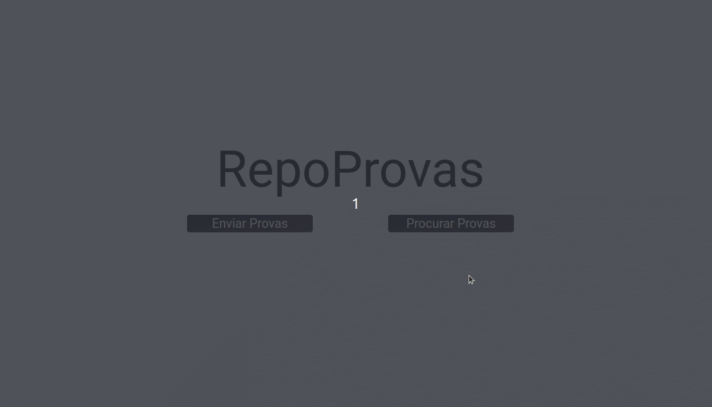

# RepoProvas

An Web application to post and see all the old tests for a determined college.



## About

This is an web application with which lots of people can share old tests made in college. Below are the implemented features:

- List all tests of a Subject
- List all tests of a Professor
- Add new test
- inputs filtering professor of a determined subject
- quantoty of tests of a determined professor or subject

By using this app anyone can share important tests for study and help community college grow.

## Technologies

The following tools and frameworks were used in the construction of the project:<br>

<p>
  
  
  
  
</p>

## How to run

1. Clone this repository
2. Clone the back-end repository at https://github.com/lucasfranchini/RepoProvasBack
3. Follow instructions to run back-end at https://github.com/lucasfranchini/RepoProvasBack
4. Install dependencies

```bash
npm i
```

5. create a .env with your back-end url like in .env.example
6. Run the front-end with

```bash
npm start
```

7. You can optionally build the project running

```bash
npm run build
```

8. Finally access http://localhost:3000 on your browser
